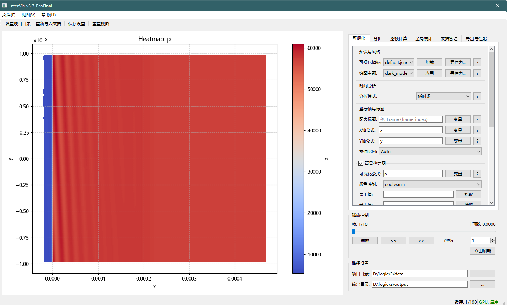
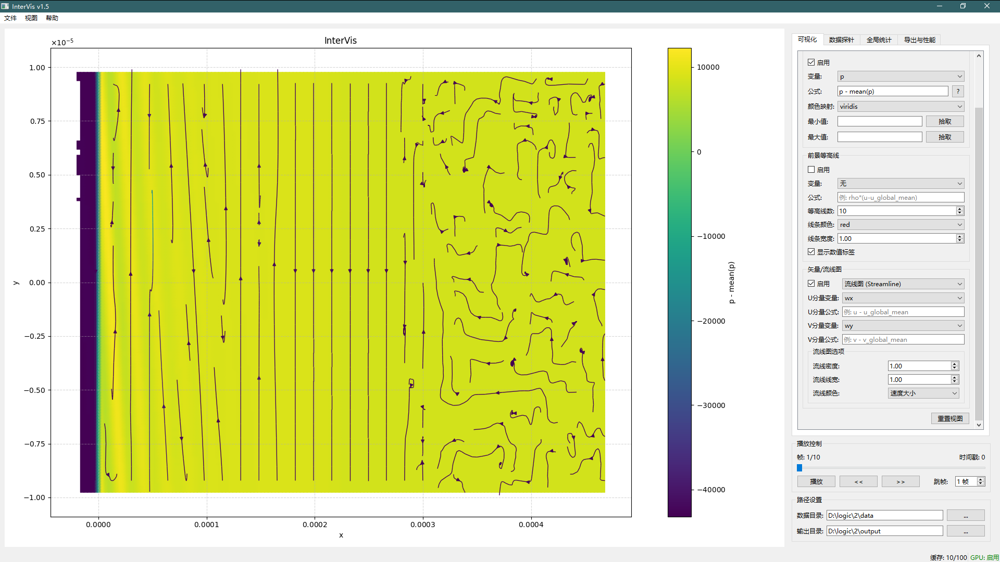
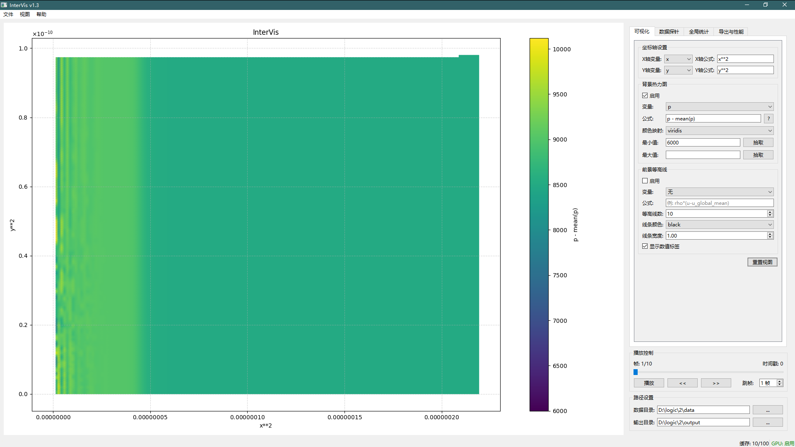
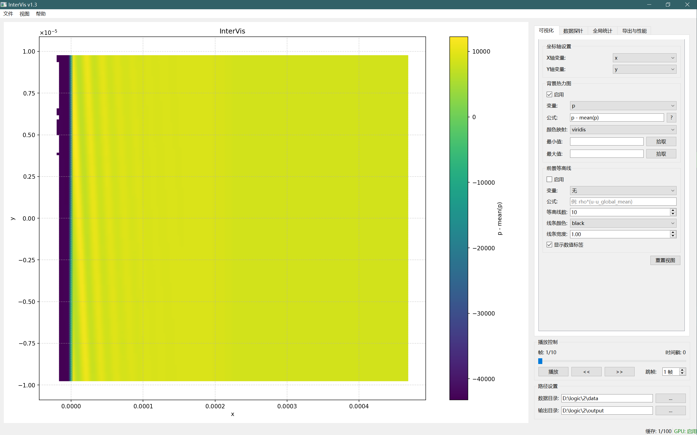
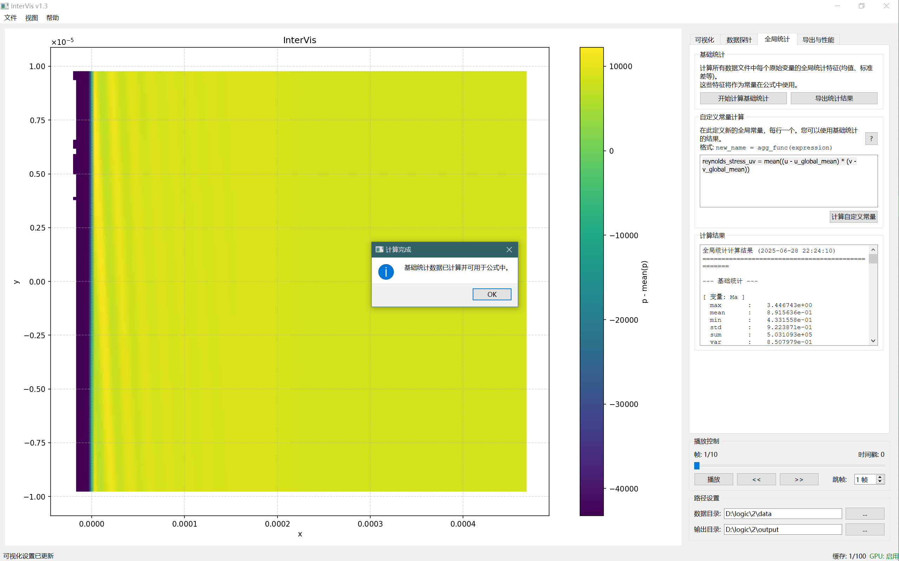
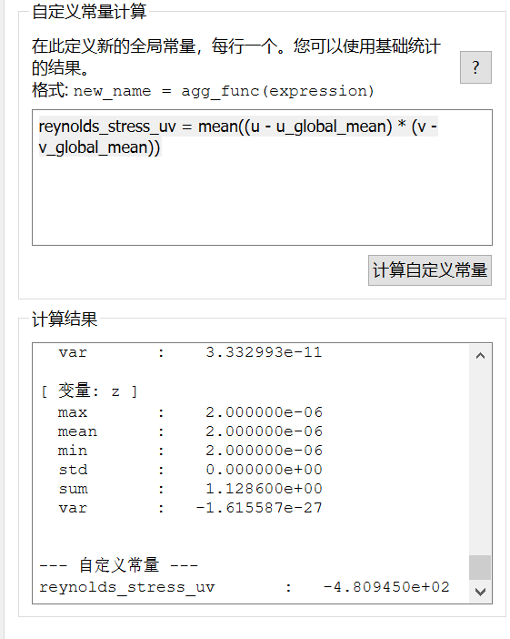
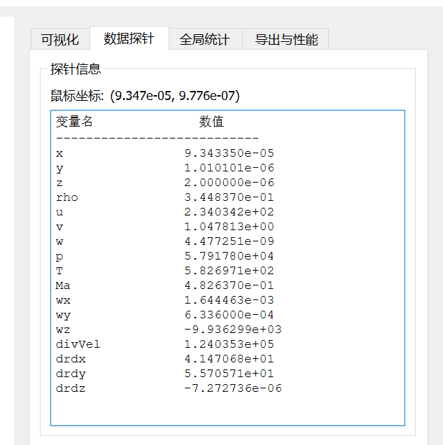
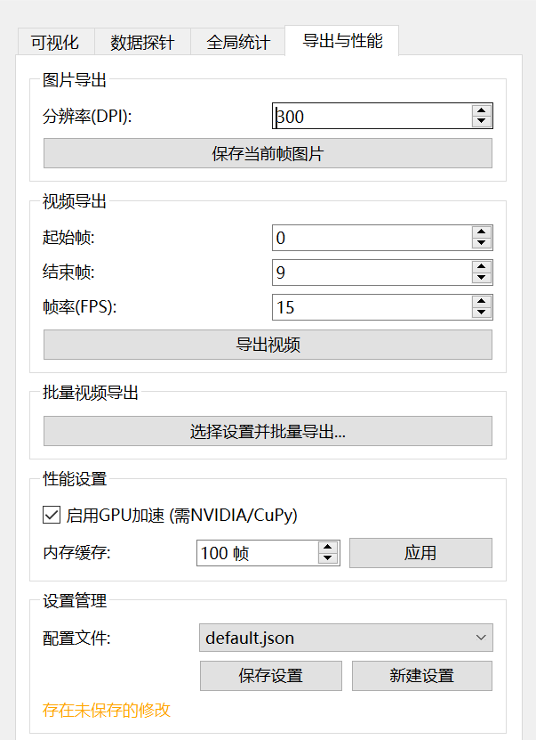
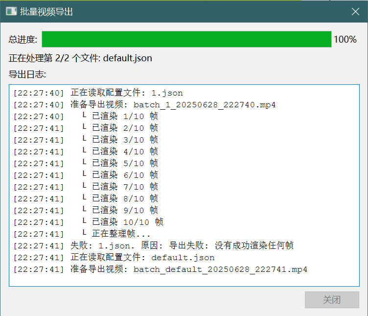
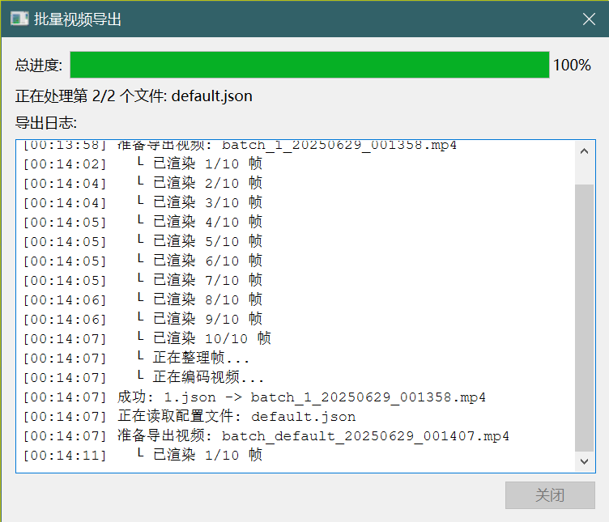

# InterVis (交互可视分析器)

[](https://www.python.org/)
[](https://opensource.org/licenses/MIT)
[](https://www.riverbankcomputing.com/software/pyqt/)
[](https://github.com/StarsWhere/InterVis)

**English:** An powerful, interactive tool for visualizing and analyzing time-series scientific computing data.
<br>
**中文:** 一款功能强大的、用于时序性科学计算数据交互可视化的分析工具。

---

InterVis is designed for researchers, engineers, and students who need to analyze and understand complex data generated from numerical simulations (e.g., CFD, fluid dynamics, physics). It specializes in handling datasets composed of numerous CSV files, where each file represents a single time step. Instead of static plots, InterVis provides a dynamic, interactive environment to explore data, create derived quantities using a powerful formula engine, and export high-quality results.

**中文:** InterVis 专为需要分析和理解数值模拟（如计算流体力学、流体动力学、物理学）所产生的复杂数据的研究人员、工程师和学生而设计。它专注于处理由大量CSV文件组成的数据集，其中每个文件代表一个时间步。InterVis 提供了一个动态、交互式的环境来探索数据，使用强大的公式引擎创建派生量，并导出高质量的可视化结果，而非传统的静态绘图。


> *The main interface of InterVis, showing the visualization area and the control panel.*
> *InterVis 主界面，展示了可视化区域与控制面板。*

## 核心功能 (Key Features)

*   📊 **多层实时交互可视化 (Multi-Layer Interactive Visualization):** 使用 Matplotlib 引擎，通过交互式缩放、平移和数据探针，流畅地探索**热力图、等高线图、矢量图和流线图**。
*   🚀 **统一公式引擎 (Unified Formula Engine):** 无需修改原始数据，即可在运行时为**坐标轴、热力图、等高线、以及矢量/流线图**动态创建和可视化复杂的派生物理量。支持单帧聚合（如 `p - mean(p)`）和全局常量。
*   🌐 **坐标轴公式 (Axis Formulas):** 将公式直接应用于坐标轴，创建自定义的、非线性的或派生的坐标系 (例如 `log(x)`, `y / u_global_mean`)，以全新的视角观察数据。
*   📈 **矢量场可视化 (Vector Field Visualization):** 新增对矢量场的强大支持。
    *   **矢量图 (Quiver Plots):** 以箭头形式直观展示矢量场（如速度场）的方向和大小。
    *   **流线图 (Streamline Plots):** 绘制平滑的流线，清晰地揭示流场结构，并可根据速度大小等着色。
*   🌐 **全局统计分析 (Global Statistics Analysis):**
    *   **基础统计 (Basic Stats):** 一键计算所有数据文件中每个变量的全局统计量（均值、标准差、方差等）。
    *   **自定义常量 (Custom Constants):** 基于基础统计量，定义并计算新的、用户指定的全局常量（如雷诺应力）。
*   🖱️ **数据探针 (Data Probing):** 将鼠标悬停在绘图区域的任意位置，即可实时查看该点（在变换后坐标系中）最近邻数据的所有原始物理量值。
*   🖼️ **高质量导出 (High-Quality Export):**
    *   支持将当前帧导出为高分辨率（可自定义 DPI）的 PNG 图像。
    *   支持将帧序列导出为 MP4 视频文件，并可**自定义渲染网格分辨率**以获得更精细的画面。
*   ⚙️ **批量处理 (Batch Processing):** 使用 JSON 配置文件自动为不同的可视化设置批量导出视频，极大提升了效率。
*   ⚡ **性能优化 (Performance-Focused):**
    *   支持 NVIDIA GPU 加速 (通过 CuPy) 来处理复杂的公式计算。
    *   内置可配置的内存缓存机制，以加速对最近访问数据帧的加载。

## 功能详解 (Features in Detail)

### 1. 实时交互可视化 (Interactive Visualization)
InterVis 的核心是一个强大的、支持多图层叠加的可视化窗口。

*   **热力图与等高线 (Heatmap & Contour):** 在您自定义的坐标系上，清晰地展示一个标量场的空间分布。
*   **矢量图与流线图 (Vector & Streamline Plots):** 在标量场之上，叠加矢量场的可视化。U分量和V分量同样支持完整的公式系统，让您可以可视化原始矢量（如 `u`, `v`）或派生矢量（如速度脉动 `u - u_global_mean`）。
*   **交互操作 (Interaction):** 使用鼠标滚轮进行缩放，使用鼠标左键拖动平移，实现对数据细节的无缝探索。


> *热力图背景上叠加了流线图。矢量图和流线图的U/V分量均支持公式计算。*
> *A streamline plot overlaid on a heatmap. Both U and V components for vector/streamline plots support formula calculations.*

*   **坐标轴变换 (Axis Transformation):** 直接在坐标轴设置中输入公式（例如 `x/1000` 将单位从米转换为千米），以非线性的、或与其它物理量耦合的方式重新定义您的坐标空间。


> *使用公式动态变换X轴和Y轴，同时用另一个公式渲染热力图。*
> *Using formulas to dynamically transform the X and Y axes, while rendering the heatmap with another formula.*

### 2. 统一公式引擎 (Unified Formula Engine)
这是 InterVis 最强大的功能之一。您无需预处理数据，就可以在任何“公式”输入框中实时计算新的物理量。

*   **坐标轴变换:** `x * cos(y / y_global_max * pi)` (创建一个扭曲的坐标系)
*   **热力图/等高线公式:** `sqrt(u**2 + v**2)` (计算速度大小)
*   **矢量/流线图公式:**
    *   U分量: `u - u_global_mean` (计算U方向的速度脉动)
    *   V分量: `v - v_global_mean` (计算V方向的速度脉动)
*   **单帧聚合:** `p - mean(p)` (计算当前帧的压力波动)
*   **全局变量:** `(u - u_global_mean) * (v - v_global_mean)` (使用全局平均值计算速度分量的乘积)

公式引擎支持所有基本数学运算、科学常数以及丰富的函数库（三角函数、对数、指数等）。


> *在热力图设置中使用公式 `p - mean(p)` 来可视化压力波动。*
> *Using the formula `p - mean(p)` in the heatmap settings to visualize pressure fluctuation.*

### 3. 全局统计分析 (Global Statistics Analysis)
在 "全局统计" 标签页，您可以对整个数据集进行深入分析。

#### 基础统计 (Basic Statistics)
点击“开始计算基础统计”按钮，InterVis 会遍历所有数据文件，计算出每个原始变量（如 `u`, `p`）的全局均值 (`u_global_mean`)、标准差 (`u_global_std`)、方差 (`u_global_var`) 等。这些计算出的值将自动成为可在公式引擎中使用的全局常量。


> *“基础统计”部分的用户界面。*
> *The user interface for the "Basic Statistics" section.*

#### 自定义常量 (Custom Constants)
在基础统计计算完成后，您可以定义自己的、更复杂的全局常量。这对于计算那些需要全时域数据聚合的物理量（如雷诺应力）至关重要。

**语法:** `常量名称 = 聚合函数(表达式)`
**示例:** `reynolds_stress_uv = mean((u - u_global_mean) * (v - v_global_mean))`

计算完成后，`reynolds_stress_uv` 也会成为一个新的全局常量，可用于任何其他公式中。


> *定义并计算自定义全局常量，结果会显示在下方的结果区。*
> *Defining and calculating a custom global constant. The result appears in the output area below.*

### 4. 数据探针 (Data Probing)
当您在可视化区域移动鼠标时，“数据探针”标签页会实时显示离鼠标指针最近的数据点的所有变量值。这对于快速检查特定区域的数值非常有用。


> *“数据探针”标签页实时显示鼠标位置的数据。*
> *The "Data Probe" tab showing real-time data at the cursor's location.*

### 5. 导出功能 (Exporting)
InterVis 提供了将分析结果保存为高质量文件的功能。

*   **图片导出:** 将当前的可视化视图保存为 PNG 图片，并可以自定义分辨率 (DPI)。
*   **视频导出:** 指定开始和结束帧、帧率 (FPS)，以及**渲染网格分辨率**，将动画导出为 MP4 视频。更高的渲染分辨率会生成更精细的视频，但耗时更长。
*   **统计导出:** 将全局统计的计算结果（包括自定义常量的定义和值）导出为易于阅读的 `.txt` 文件。


> *导出图片和视频的设置选项，包括新增的视频渲染网格分辨率。*
> *Settings for exporting images and videos, including the new video render grid resolution.*

### 6. 批量处理 (Batch Processing)
对于需要生成多组不同设置的视频的场景，批量导出功能可以为您节省大量时间。您可以：
1.  为每个场景创建并保存一个 `.json` 配置文件。
2.  在“批量视频导出”功能中一次性选择所有这些配置文件。
3.  InterVis 将自动为每个配置文件加载设置并渲染出对应的视频。


> *批量导出任务的进度对话框，显示当前进度和日志。*
> *The progress dialog for a batch export task, showing overall progress and a log.*

### 7. 性能与设置 (Performance & Settings)
*   **GPU 加速:** 如果您安装了 `cupy` 并拥有兼容的 NVIDIA GPU，可以勾选此项以加速公式计算，尤其是在视频导出时效果显著。
*   **缓存大小:** 调整加载到内存中的数据帧数量。增加缓存可以使播放和来回切换帧更流畅，但会消耗更多内存。
*   **设置管理:** 所有的可视化和性能设置都可以保存到一个 `.json` 文件中，方便后续加载和分享。


> *GPU 加速、缓存大小和配置文件管理。*
> *GPU acceleration, cache size, and configuration file management.*

## 技术栈 (Technology Stack)

*   **核心框架 (Core Framework):** Python 3
*   **用户界面 (GUI):** PyQt6
*   **绘图引擎 (Plotting Engine):** Matplotlib
*   **数据处理 (Data Handling):** Pandas, NumPy, SciPy
*   **视频编码 (Video Encoding):** MoviePy (推荐), imageio (备用)
*   **GPU 加速 (GPU Acceleration):** CuPy (可选, 推荐用于 NVIDIA GPU)

## 安装 (Installation)

1.  **克隆仓库 (Clone the repository):**
    ```bash
    git clone https://github.com/StarsWhere/InterVis.git
    cd InterVis
    ```

2.  **创建虚拟环境 (Create a virtual environment) (推荐):**
    ```bash
    python -m venv .venv
    # Windows
    .venv\Scripts\activate
    # macOS/Linux
    source .venv/bin/activate
    ```

3.  **安装依赖 (Install dependencies):**
    ```bash
    pip install -r requirements.txt
    ```
    *`requirements.txt` 应包含:*
    ```
    pyqt6
    matplotlib
    numpy
    pandas
    scipy
    moviepy
    imageio
    imageio-ffmpeg
    ```

4.  **(可选) 安装 GPU 支持 (Optional: Install GPU support):**
    如果您有 NVIDIA GPU 和 CUDA 环境，安装 CuPy 可以极大地提升性能。请根据您的 CUDA 版本选择合适的 CuPy 版本。
    > 访问 [CuPy 安装指南](https://docs.cupy.dev/en/stable/install.html) 获取详细指令。
    > 例如，对于 CUDA 12.x:
    ```bash
    pip install cupy-cuda12x
    ```

## 使用方法 (Usage)

1.  **准备数据 (Prepare your data):**
    将您的 `.csv` 数据文件放入项目根目录下的 `data` 文件夹中。请确保文件按时间顺序命名（例如 `data_001.csv`, `data_002.csv`, ...）。

2.  **运行程序 (Run the application):**
    ```bash
    python main.py
    ```

3.  **开始分析 (Start analyzing):**
    *   程序启动后会自动加载 `data` 文件夹中的数据。
    *   **推荐流程:**
        1.  切换到 "全局统计" 标签页，点击 "开始计算基础统计"。
        2.  如果需要，定义并计算您的自定义常量。
        3.  切换回 "可视化" 标签页，在公式中使用这些已计算的常量。
        4.  调整可视化设置（热力图、等高线、矢量图等），使用播放控件查看动画。
        5.  导出您需要的结果。

## 目录结构 (Directory Structure)
项目结构经过重构，以实现更好的模块化和可维护性。
The project structure has been refactored for better modularity and maintainability.
```
InterVis/
├── data/              # 存放您的 CSV 数据文件 (Place your CSV data files here)
├── logs/              # 程序运行日志 (Application logs)
├── output/            # 导出的图片、视频和统计结果 (Exported images, videos, stats)
├── png/               # README 文档所需的图片 (Images for this README)
├── settings/          # 保存的可视化配置文件 (.json) (Saved configuration files)
├── src/               # 源代码 (Source code)
│   ├── core/          # 核心逻辑与引擎 (Core logic and engines)
│   │   ├── __init__.py
│   │   ├── data_manager.py
│   │   ├── formula_engine.py
│   │   ├── rendering_core.py
│   │   ├── statistics_calculator.py
│   │   └── workers.py
│   ├── handlers/      # UI事件与业务逻辑处理器 (UI event and business logic handlers)
│   │   ├── __init__.py
│   │   ├── config_handler.py
│   │   ├── export_handler.py
│   │   ├── playback_handler.py
│   │   └── stats_handler.py
│   ├── ui/            # UI 相关模块 (UI-related modules)
│   │   ├── __init__.py
│   │   ├── dialogs.py
│   │   └── ui_setup.py
│   ├── utils/         # 辅助工具 (Utility modules)
│   │   ├── __init__.py
│   │   ├── gpu_utils.py
│   │   ├── help_content.py
│   │   ├── help_dialog.py
│   │   └── logger.py
│   ├── visualization/ # 可视化相关模块 (Visualization modules)
│   │   ├── __init__.py
│   │   ├── headless_renderer.py
│   │   ├── plot_widget.py
│   │   └── video_exporter.py
│   └── main_window.py # 主窗口 (协调器) (Main window (coordinator))
├── main.py            # 主程序入口 (Main application entry point)
├── README.md          # 本文档 (This file)
└── requirements.txt   # Python 依赖项 (Python dependencies)
```

## 未来计划 (Future Plans)

*   [x] ~~**矢量图与流线图 (Vector & Streamline Plots):**~~ **(v1.5 已实现)**
*   [x] ~~**UI/UX 改进 (UI/UX Improvements):**~~ **(v1.6 已实现)**
*   [x] **代码重构 (Code Refactoring):** **(v1.7 已实现)** - 重构项目结构，分离关注点，提高可维护性。
*   [ ] **3D 可视化支持 (3D Visualization Support):** 增加对 3D 数据切片或体渲染的支持。
*   [ ] **更丰富的分析功能 (More Analysis Functions):** 集成如傅里叶变换 (FFT) 等更高级的数据分析工具。

## 贡献 (Contributing)
欢迎各种形式的贡献！如果您有任何建议、发现任何错误或想要添加新功能，请随时提交 Pull Request 或创建 Issue。

## 许可证 (License)
本项目采用 [MIT License](LICENSE) 开源。

## 作者 (Author)
*   **StarsWhere** - [GitHub Profile](https://github.com/StarsWhere)
