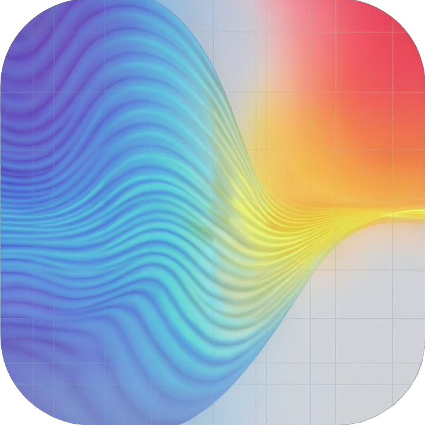
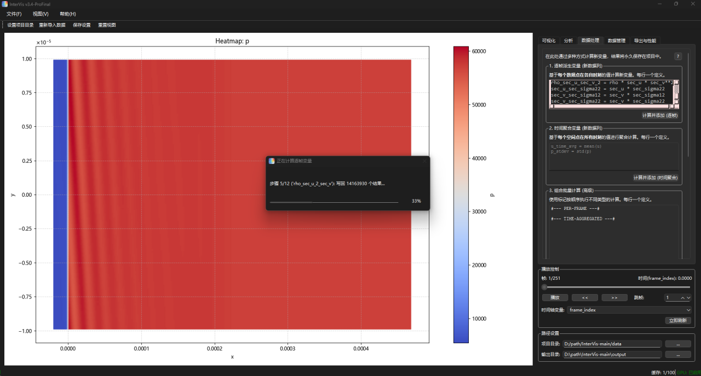
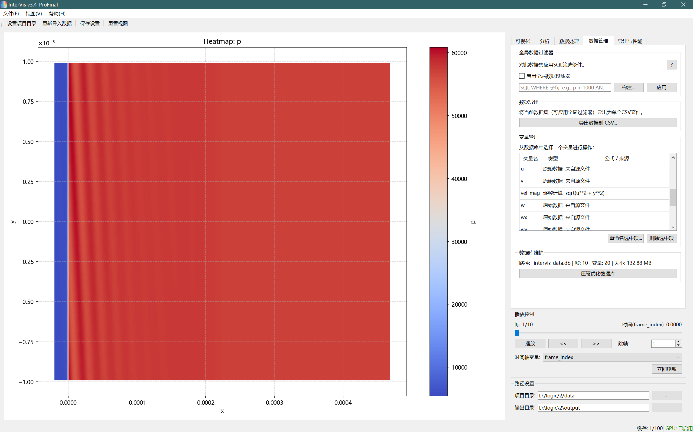
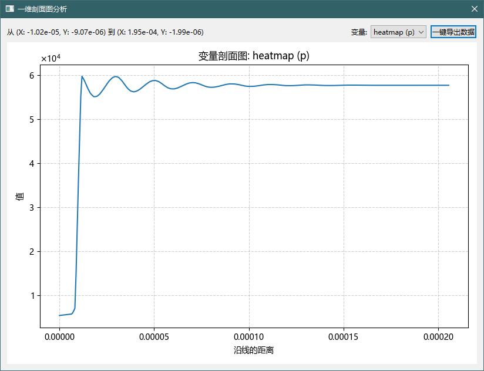
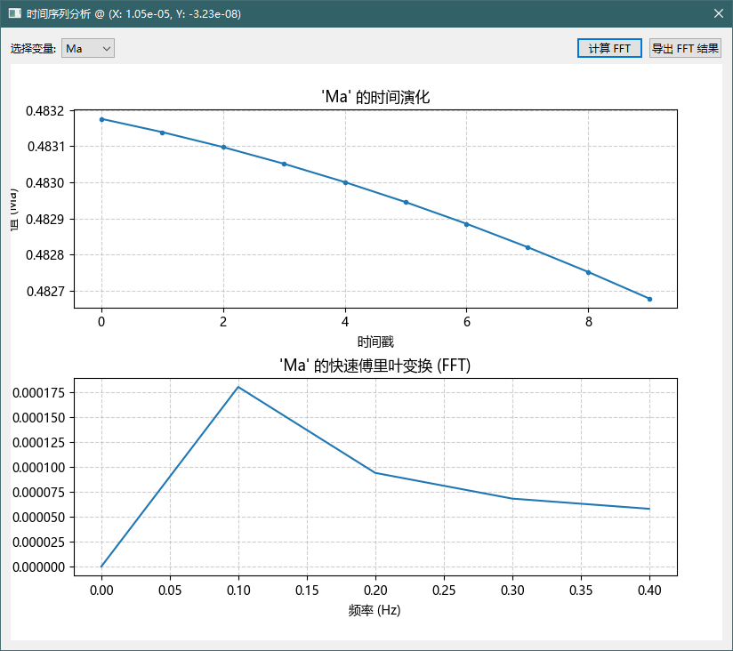
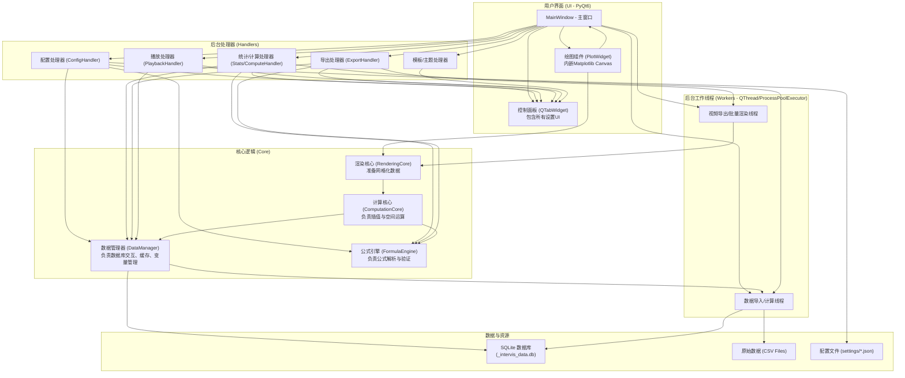

# InterVis v3.5-ProFinal



**InterVis 是一个专为科学与工程领域设计的、交互式、高性能的二维瞬态场数据后处理与可视化平台。**

它致力于简化和加速从大规模原始数据（如计算流体力学CFD、分子动力学MD的仿真结果）到深刻物理洞察的转化过程。**v3.5-ProFinal** 版本在v3.5的基础上，引入了全新的 **数据管理中心**、强大的 **组合批量计算引擎** 和完善的 **变量管理** 功能，通过一个更直观的图形化界面，用户无需编写复杂的分析脚本，即可对数据进行深入的探索、计算、分析和可视化，并能一键生成用于报告、演示或学术出版的高质量图表与动画视频。

## 🚀 v3.5-ProFinal 版本亮点

*   **全新的“数据管理”中心**:
    *   **变量管理器**: 现在您可以在图形界面中方便地 **重命名** 或 **删除** 任何已创建的派生变量，所有变更将自动同步到数据库。
    *   **过滤器构建器**: 新增一个可视化的SQL构建工具，让您无需手动编写代码即可轻松创建复杂的全局数据过滤条件。

*   **强大的“组合批量计算”引擎**:
    *   引入了全新的多步计算模式，允许用户在一个任务中定义 **按顺序执行** 的多个计算块（例如，先计算逐帧变量，再基于其结果计算时间聚合变量），极大地简化了复杂分析流程（如雷诺分解）。

*   **更智能的公式系统**:
    *   所有批量计算（逐帧、时间聚合、组合、全局常量）现在都支持 **依赖关系自动排序**。您无需关心变量定义的先后顺序，InterVis会自动分析并以正确的顺序执行计算。

*   **核心性能优化**:
    *   派生变量的计算现在采用 **多进程并行处理** (`ProcessPoolExecutor`)，在多核CPU上能显著提升大规模数据集的处理速度。

---

## ✨ 核心功能详解

InterVis 提供了一整套从数据导入到结果导出的完整解决方案，其核心功能涵盖了数据处理、公式计算、交互分析、多层可视化、效率定制和成果导出等多个方面。

### 💾 一体化数据引擎

*   **自动化数据导入与管理**:
    *   **智能扫描与导入**: 自动扫描指定项目目录下的所有 `.csv` 文件，并将它们高效地整合到一个单一的、可移植的 **SQLite 数据库文件 (`_intervis_data.db`)** 中。此过程在后台完成，不阻塞UI。
    *   **元数据自动生成**: 在导入过程中，程序会自动计算并存储每个变量的基础统计数据（均值、最值、方差等），为后续的归一化和分析提供支持。
    *   **多模式派生变量持久化**:
        *   **逐帧派生变量**: 用户可以定义基于**同一时刻**其他物理量的新变量（如 `kinetic_energy = 0.5 * rho * (u*u + v*v)`），程序会计算结果并将其作为新的一列 **永久添加** 到数据库中。
        *   **时间聚合变量**: 可以对每个**空间点**沿整个**时间轴**进行聚合计算（如 `u_time_avg = mean(u)`），并将结果（如时间平均场、标准差场）作为新的、不随时间变化的场存入数据库，是进行定常分析和雷诺分解的利器。

*   **高性能数据访问**:
    *   **智能内存缓存**: 内置一个可配置大小的LRU（最近最少使用）缓存，用于存放最近访问过的数据帧。这使得在时间轴上反复拖动或播放动画时，能够获得极为流畅的体验。
    *   **全局数据过滤器**: 用户可以应用一个全局的 **SQL `WHERE` 子句**（例如 `p > 101325 AND x < 0.5`）来筛选整个数据集。所有后续的可视化、统计计算和数据导出都将只在此数据子集上进行，非常适合用于聚焦于特定的物理区域或现象。

### 🧮 强大的公式系统

公式系统是 InterVis 的核心，它赋予了用户在图形界面中进行复杂数据计算的能力。

*   **标准与科学函数库**:
    *   支持所有标准的Python数学运算符 (`+`, `-`, `*`, `/`, `**`) 和函数 (`sqrt`, `sin`, `log`, `abs`, `min`, `max` 等)。
    *   内置了丰富的科学常数，如 `pi`, `e`, `g` (重力加速度) 等，可直接在公式中使用。

*   **高级计算函数**:
    *   **逐帧聚合函数**: 可在任何可视化公式中使用，对 **当前帧** 的所有数据点进行实时聚合计算。支持 `mean(expr)`, `sum(expr)`, `std(expr)`, `median(expr)`, `min_frame(expr)`, `max_frame(expr)`。例如，`p - mean(p)` 可以实时显示压力的脉动量。
    *   **空间微分算子**: 这是InterVis最强大的功能之一。用户可以直接在公式中调用微分算子，程序会自动在后台完成插值和有限差分计算：
        *   `grad_x(field)`, `grad_y(field)`: 计算标量场 `field` 的梯度。
        *   `div(u_field, v_field)`: 计算矢量场 `(u, v)` 的散度。
        *   `curl(u_field, v_field)`: 计算2D矢量场 `(u, v)` 的旋度（涡量）。
        *   `laplacian(field)`: 计算标量场的拉普拉斯算子。
        *   **任意嵌套**: 这些算子可以自由嵌套，例如 `grad_x(curl(u, v))`。

*   **全局变量与常量**:
    *   **自定义全局常量**: 用户可以在“数据处理”标签页定义新的全局常量，这些常量将在 **整个数据集** 上进行计算（支持SQL模式和并行迭代模式），并被永久保存。例如 `tke_global_mean = mean(0.5 * (u**2 + v**2))`。
    *   **全局引用**: 所有计算出的全局常量（包括基础统计和自定义常量）都可以在任何公式框中被直接引用。

*   **实时验证与智能排序**:
    *   所有公式输入框都会进行实时语法检查。当输入的公式存在语法错误时，输入框会变为红色并提供错误提示，有效避免了计算错误。
    *   **依赖自动排序**: 在所有批量计算模式下，您无需关心定义顺序。InterVis会自动分析依赖关系，确保例如 `tke = 0.5 * rho * vel_mag**2` 会在 `vel_mag = sqrt(u*u+v*v)` 计算之后执行。

### 🔬 多维度交互式分析

*   **高级数据探针**:
    *   **面板探针**: 在右侧“分析”面板中，当鼠标在图表上移动时，探针窗口会实时显示 **两种信息**：离鼠标指针最近的 **原始数据点** 的值，以及通过周围数据插值计算出的、鼠标指针精确位置的 **插值数据** 的值。
    *   **悬浮探针**: 用户可以在“分析”面板中勾选任意数量关心的变量。之后，当鼠标在图表上悬停时，一个紧凑的、内容自适应的窗口会**直接跟随意到**，实时显示这些变量的数值。这使得用户在观察图表细节时，**无需将视线移开**即可获取关键数据。

*   **一维剖面图分析**:
    *   **自由绘制**: 用户可以在2D图上通过点击两次来定义一条剖面线的起点和终点。
    *   **坐标定义**: 支持通过精确输入坐标值来定义剖面线。
    *   **多变量查看**: 弹出的剖面图窗口中有一个下拉菜单，允许用户轻松切换不同的物理量，查看它们沿该剖面线的分布情况。
    *   **一键导出**: 可以将当前显示的剖面数据（距离、数值）一键导出为 `.csv` 文件。

*   **时间序列分析 (FFT)**:
    *   **拾取点**: 用户可以通过在图上点击或输入精确坐标来选择一个空间点。
    *   **时间演化**: 程序会立即弹出一个新窗口，展示该点上所有物理量随时间变化的曲线。
    *   **频域分析**: 在时间序列图窗口中，可以一键对当前数据进行 **快速傅里叶变换 (FFT)**，分析其频域特性，帮助识别主要的振动或波动频率。
    *   **一键导出**: FFT的计算结果（频率、振幅）可以一键导出为 `.csv` 文件。

### 🎨 丰富的可视化与定制

*   **多图层叠加**: 支持将背景热力图、前景等高线、矢量/流线图三个图层自由组合叠加，每个图层都可以使用独立的计算公式。
*   **高度可定制的图层**:
    *   **热力图**: 支持从多种内置（如 `jet`, `coolwarm`, `viridis`）或用户自定义的颜色映射表 (Colormap) 中选择，并可精确控制数据范围的最小值和最大值。
    *   **等高线**: 可自由调整等高线的数量、颜色、线型、线宽，并可选择是否显示数值标签。
    *   **矢量/流线图**: 支持 **Quiver** (箭头矢量) 和 **Streamline** (流线) 两种模式。Quiver图可调疏密和箭头缩放；Streamline图可调疏密、线宽，并支持按速度大小、U/V分量或固定色进行着色。

*   **模板与主题系统**:
    *   **可视化模板**: 一键保存和加载一整套复杂的可视化方案（包括所有图层的公式、设置、坐标轴定义等），极大提升了重复性工作的效率。
    *   **绘图主题**: 一键切换图表的整体美学风格。内置 `default`, `dark_mode`, `paper_bw` (论文黑白) 等主题，并允许用户创建和保存自己的主题。

### ⚡ 性能与导出

*   **CPU/GPU 双加速**:
    *   **CPU并行**: 派生变量计算等任务默认利用 **多进程并行**，充分利用多核CPU资源。
    *   **GPU 加速**: 若检测到兼容的NVIDIA显卡和CuPy库，用户可选择启用GPU加速。这会将插值和公式计算等密集型任务转移到GPU上，在处理复杂公式或高分辨率网格时带来数倍的性能提升。
*   **灵活的导出选项**:
    *   **图像导出**: 将当前渲染的视图保存为指定DPI的高分辨率PNG图像。
    *   **视频导出**: 将指定的时间帧范围根据当前的可视化设置渲染为MP4视频文件。
    *   **并行批量导出**: 最强大的导出功能之一。用户可以选择多个“可视化模板”（配置文件），InterVis会启动并行工作线程，同时将这些模板渲染成各自对应的视频，极大缩短了批量生成成果的时间。
    *   **数据导出**: 支持将全局统计结果、过滤后的数据集等多种中间数据和分析结果导出为 `.csv` 文件。

---

## 📸 应用界面

#### **主界面概览**
InterVis 的主界面设计简洁，左侧为宽阔的绘图区，右侧为功能强大的控制面板，通过标签页清晰地组织了可视化、分析、计算、数据管理和导出等所有功能模块。


#### **数据处理与管理**
全新的“数据处理”与“数据管理”中心，将复杂的计算流程和数据维护操作整合到简洁的UI中。

| 组合批量计算 | 变量管理器 |
| :---: | :---: |
|  |  |
| 在一个任务中定义并顺序执行多种计算，自动处理依赖关系，轻松完成雷诺分解等复杂分析。 | 在表格中清晰地查看所有原始变量和派生变量，并可随时对派生变量进行 **重命名** 或 **删除** 操作。 |

#### **交互式分析工具**
InterVis 提供了多种即时反馈的交互式工具来深入挖掘数据，将复杂的分析流程简化为几次鼠标点击。

| 剖面图分析 | 时间序列与FFT分析 |
| :---: | :---: |
| |  |
| 在2D场中绘制一条线，立即查看沿线的数据分布。支持在多个变量间自由切换并可一键导出数据。 | 拾取空间中的一个点，分析其物理量随时间的变化和频域特性。FFT结果同样支持一键导出。 |

---

## 🏗️ 软件架构

InterVis 采用现代的、模块化的软件架构，基于 PyQt6 和 Matplotlib 构建，确保了代码的清晰性、可维护性和未来的可扩展性。

### 架构图



*   **UI层 (PyQt6)**: 完全负责用户界面的构建和布局。`MainWindow` 是主程序的入口，它包含了作为核心显示区域的 `PlotWidget`。`PlotWidget` 封装了 Matplotlib 的 `FigureCanvas`，并处理所有与绘图相关的鼠标交互事件（缩放、平移、拾取）。
*   **处理器层 (Handlers)**: 这一层是UI和核心逻辑之间的桥梁。每个 `Handler` (如 `ConfigHandler`, `ComputeHandler`) 都是一个独立的类，负责一个特定的功能域。它们监听UI控件发出的信号（如按钮点击），然后调用 `Core` 层的相应方法来执行任务，并将结果反馈给UI。
*   **核心逻辑层 (Core)**: 这是应用的“引擎”。`DataManager` 封装了所有与 SQLite 数据库的交互逻辑，包括数据的增删改查、变量重命名/删除和智能缓存。`FormulaEngine` 负责解析、验证和评估用户输入的复杂公式。`ComputationCore` 和 `RenderingCore` 则负责将离散的数据点通过插值和计算转换为可以在图上绘制的连续网格化数据。
*   **后台线程 (Workers)**: 对于所有可能耗时的操作，如大规模数据导入、派生变量的全数据集计算、以及视频的逐帧渲染，InterVis 都会创建一个 `QThread` 或使用 `ProcessPoolExecutor` 来执行。这确保了即使用户在进行数分钟的视频导出，主界面的UI依然能够响应，提供了优秀的用户体验。

---

## 🧠 核心概念解析

### 四种核心计算模式的对比

InterVis v3.5-ProFinal 提供了四种强大的、互补的计算模式，理解它们的区别是高效分析的关键。

| 计算模式 | **逐帧派生变量** | **时间聚合变量** | **全局常量** | **组合批量计算** |
| :--- | :--- | :--- | :--- | :--- |
| **核心思想** | `f(point, time) -> value(point, time)` | `f(point, all_times) -> value(point)` | `f(all_points, all_times) -> single_value` | **顺序执行**上述计算的**工作流** |
| **计算基础** | 同一时刻、同一点的其它值 | 同一点、所有时刻的值的集合 | 所有点、所有时刻的值的集合 | 按块定义的多个计算步骤 |
| **结果形式** | 新的、**随时间和空间变化**的数据列 | 新的、**只随空间变化**的数据列 | **不随任何因素变化**的单一标量值 | 多个新的数据列或常量 |
| **典型示例** | 动能: `0.5*rho*(u*u+v*v)` | 时间平均速度: `mean(u)` | 全局平均湍动能: `mean(0.5*(u*u+v*v))` | 一个完整的雷诺分解脚本 |
| **UI位置** | 数据处理 -> 逐帧派生变量 | 数据处理 -> 时间聚合变量 | 数据处理 -> 全局常量 | 数据处理 -> **组合批量计算** |
| **主要用途** | 计算瞬态物理量 | 计算定常场、平均场、脉动强度场 | 计算整个过程的特征标量 | **自动化多步分析流程** |

### 模板 (Template) vs 主题 (Theme)

理解这两个概念的区别对于高效使用 InterVis至关重要。

| 特性 | **可视化模板** | **绘图主题** |
| :--- | :--- | :--- |
| **核心作用** | 定义 **“画什么”** (What to plot) | 定义 **“怎么画”** (How to plot) |
| **保存内容** | 数据内容和可视化逻辑的快照 | 图表的外观和美学风格 |
| **具体条目** | - 热力图/等高线/矢量图的公式<br>- 各图层是否启用<br>- 颜色映射表、等高线数量、线宽<br>- 坐标轴X/Y的公式<br>- 时间分析模式（瞬时/平均） | - 图表背景色、坐标轴颜色<br>- 网格线颜色、样式、宽度<br>- 坐标轴标签、标题的字体和颜色<br>- 默认线条颜色和样式 |
| **文件位置** | `settings/templates/` | `settings/themes/` |
| **应用场景** | 需要在不同物理量分析视角间快速切换，如“速度压力分析”模板和“涡量散度分析”模板。 | 需要为不同场合输出图表，如为PPT演示应用`dark_mode`，为学术论文应用`paper_bw`。 |

---

## 🚀 快速开始

### 依赖环境

*   **Python 3.8+**
*   **核心依赖**:
    *   `PyQt6`: 图形用户界面框架。
    *   `numpy`: 科学计算基础库。
    *   `pandas`: 高效的数据结构和数据分析工具。
    *   `matplotlib`: 核心的2D绘图库。
    *   `scipy`: 科学计算库，用于插值等功能。
*   **可选依赖**:
    *   **GPU加速**: `cupy` (请务必根据您的NVIDIA驱动和CUDA版本安装对应的Cupy版本, e.g., `pip install cupy-cuda11x`)。
    *   **视频导出**: `moviepy` 或 `imageio[ffmpeg]` (推荐 `moviepy` 以获得更广泛的格式支持)。

### 安装步骤

1.  **克隆仓库**
    ```bash
    git clone https://github.com/StarsWhere/InterVis.git
    cd InterVis
    ```

2.  **(推荐) 创建并激活Python虚拟环境**
    ```bash
    python -m venv venv
    
    # 在 Windows 上:
    .\venv\Scripts\activate
    
    # 在 macOS/Linux 上:
    source venv/bin/activate
    ```

3.  **安装所有依赖**
    ```bash
    pip install -r requirements.txt
    
    # (或者手动安装)
    pip install PyQt6 numpy pandas matplotlib scipy moviepy
    ```

### 运行程序

进入项目根目录，执行 `main.py`:
```bash
python main.py
```

---

## 📖 使用指南

1.  **首次启动与数据导入**
    *   启动程序后，首先通过菜单栏 `文件` -> `设置项目目录...` (或工具栏的文件夹图标) 来选择您存放 `.csv` 数据文件的文件夹。
    *   InterVis 会检查该目录下是否存在数据库文件。如果是首次加载，它会弹窗询问是否根据目录内的CSV文件创建新数据库。
    *   点击“是”，程序将启动一个后台任务来导入所有数据并计算基础统计信息。这个过程可能需要一些时间，具体取决于您的数据量。

2.  **基本的可视化操作**
    *   转到右侧控制面板的 **"可视化"** 标签页。
    *   在 **"背景热力图"** 的组框(GroupBox)中，勾选其标题旁的复选框来启用该图层。
    *   在其 **"可视化公式"** 输入框中，键入一个简单的公式，例如 `p` (如果您的数据中有压力 `p` 变量)。
    *   图表会自动刷新，显示压力 `p` 的热力图。

3.  **进行交互式分析**
    *   切换到 **"分析"** 标签页。
    *   **面板探针** 是默认启用的，当您在图上移动鼠标时，它会实时显示该点的数据。要使用新的 **悬浮探针**，请在下方的变量列表中勾选您想看的变量。
    *   点击 **"拾取时间序列点"** 按钮，然后在图表上您感兴趣的位置单击。一个新窗口会弹出，显示该点随时间的变化。在新窗口中点击 **"计算 FFT"** 即可看到频域图。

4.  **使用数据处理功能**
    *   切换到 **"数据处理"** 标签页。
    *   在 **"逐帧派生变量"** 框中，输入 `vel_mag = sqrt(u**2 + v**2)`，然后点击“计算并添加”。
    *   计算完成后，您就可以在任何公式框中使用新变量 `vel_mag` 了。

5.  **管理变量与数据**
    *   切换到 **"数据管理"** 标签页。
    *   在 **"变量管理"** 表格中，您可以看到所有变量的列表。
    *   选中一个您创建的派生变量，然后点击 **"重命名..."** 或 **"删除"** 按钮来管理它。
    *   在 **"全局数据过滤器"** 中，输入 `x > 0` 并勾选“启用”，然后点击“应用”。图表将只显示X坐标为正的数据区域。

6.  **导出成果**
    *   转到 **"导出与性能"** 标签页。
    *   点击 **"保存当前渲染图表"** 即可导出一张PNG图片。
    *   若要导出视频，请先在此处设置好 **起止帧** 和 **帧率(FPS)**，然后点击 **"导出视频"**。

---

## 未来计划与发展路线图

InterVis v3.5-ProFinal 已经具备了强大而稳定的功能集，但作为一个致力于服务科学与工程领域的工具，我们对它的未来发展有更长远的规划。以下是我们计划在未来版本中探索和实现的功能，我们欢迎社区的建议和贡献来共同塑造 InterVis 的未来。

我们的路线图主要围绕以下几个核心方向展开：**核心性能与数据支持的深化、可视化维度的扩展、分析能力的增强、以及用户体验与开放性的提升**。

### 🔮 近期计划 (Short-Term Goals)

*   **增强的公式编辑器**:
    *   为所有公式输入框增加 **语法高亮** 和 **自动补全** 功能。
*   **国际化 (i18n) 支持**:
    *   提供完整的 **英文** 语言包，以服务更广泛的国际用户。
*   **可视化体验优化**:
    *   **可视化颜色条编辑器**: 允许用户在UI中直观地调整颜色条的范围、标签和样式。
    *   **交互式注解**: 允许用户在图表上直接添加箭头、文本框等注解。
*   **数据分析增强**:
    *   **区域统计功能**: 允许用户在图表上通过拖拽鼠标框选一个矩形区域，并即时计算该区域内数据的统计信息。

### 🚀 中期计划 (Mid-Term Goals)

*   **扩展数据格式支持**:
    *   **原生NetCDF/HDF5支持**: 开发新的数据导入模块，直接读取 **NetCDF (.nc)** 和 **HDF5 (.h5)** 文件。
    *   **VTK文件导出**: 增加将插值后的网格化数据导出为 **VTK (.vtk)** 格式的功能，以便与 ParaView, VisIt 等软件对接。
*   **下一代数据后端探索**:
    *   研究并测试使用 **DuckDB** 替代 SQLite，有望在分析查询场景下带来数量级的性能提升。
*   **高级分析工具集成**:
    *   集成如 **本征正交分解 (POD)** 或 **动态模式分解 (DMD)** 等高级数据分析算法。
    *   **对比视图模式**: 开发一个新的视图模式，允许用户并排或以“差值”模式打开两个不同的数据集或时刻，进行直观对比。
*   **开放性与脚本化**:
    *   **插件系统 (Plugin API)**: 设计并实现一个插件API，允许社区开发者编写自己的数据加载器、计算函数或分析工具。
    *   **Python脚本接口**: 提供一个基础的Python API，允许用户在脚本或 Jupyter Notebook 中调用 InterVis 的核心能力。

### 🌠 远期愿景 (Long-Term / Ambitious Goals)

*   ### **全面的三维 (3D) 可视化支持**
    这是我们最核心的远期目标。将 InterVis 从一个2D平台扩展为全功能的3D平台。
    ```mermaid
    graph TD
        subgraph DataHandling["3D数据处理"]
            A["3D数据解析器<br/>(NetCDF, VTK, OpenFOAM)"]
            B["3D网格化/非结构化数据结构"]
            C["八叉树/k-d树用于空间查询"]
        end

        subgraph RenderingEngine["3D渲染引擎"]
            D["OpenGL/Vulkan后端集成"]
            E["体积渲染(光线投射)"]
            F["等值面提取(行进立方体)"]
            G["3D流线/流带"]
        end

        subgraph Interaction["3D交互"]
            H["3D相机控制<br/>(轨道、平移、缩放)"]
            I["3D切片和裁剪平面"]
            J["3D数据探测"]
        end

        A --> B; B --> C; B --> E; B --> F; B --> G;
        D --> E; D --> F; D --> G;
        H --> D; I --> D; J --> D;
    ```
    *   **3D渲染能力**: 实现 **等值面 (Isosurface)**、**体渲染 (Volume Rendering)** 和 **交互式切片 (Slicing Planes)**。

*   **云与协作**:
    *   探索将 InterVis 的核心计算引擎部署为云服务，并实现项目与可视化模板的云端同步与共享。

---

## 🤝 贡献与支持

InterVis 是一个充满活力的开源项目，它的成长离不开社区的支持。如果您对上述任何计划感兴趣，或者有自己的新想法，我们都非常欢迎您：

*   在 GitHub上 **创建 Issue** 来讨论新功能或报告问题。
*   **Fork 本项目** 并提交您的 **Pull Request**。
*   参与文档的撰写和翻译工作。

让我们一起努力，将 InterVis 打造成一个更加强大、易用和开放的科学可视化平台！

## 📜 许可证

本项目采用 [MIT License](./LICENSE) 开源许可证。